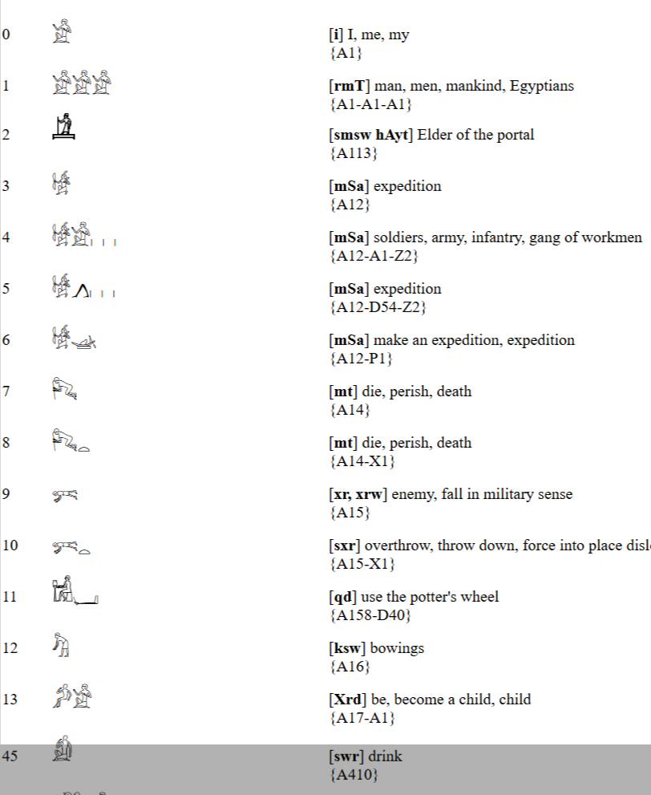

<h1>Allie's Aegyptian Dictionary</h1>

This list was compiled from a source I found. I'm pretty sure it's a retranscription of the Dickson Dictionary.
The source didn't list an author. I convert Gardiner to unicode to display on the page.
Where hieroglyphs were missing I found some graphics from the Abydos font that were shared on wikimedia.
Not all of the missing hieroglyphs could be found.

There are still quite a few issues to tackle:
I'm working on parsing the layout formats.
I also need to check against other sources to see if there are any entries missing.
Finish the online search.
PDF print doesn't split hieroglyphs in some areas - this will come with a better formatter.

Lookup by Heiroglyph \

Lookup by Pronunciation \

Lookup by Translation \
